<div align="center">

# <div style="display: flex; align-items: center; justify-content: center; gap: 10px"> Saavn Music </div>

### A Modern, High-Performance JioSaavn Client

[](https://reactnative.dev/)
[](https://expo.dev/)
[](LICENSE)
[](https://www.android.com/)

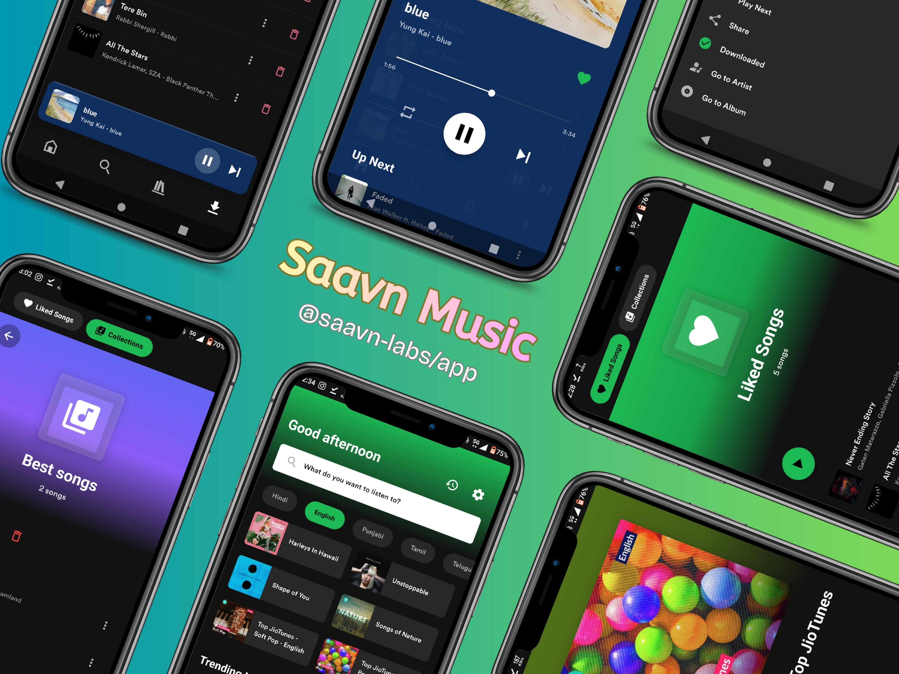

**Experience music streaming reimagined with cutting-edge technology and thoughtful design.**

[Features](#-features) • [Screenshots](#-screenshots) • [Quick Start](#-quick-start) • [Troubleshooting](#-troubleshooting) • [Legal Notice](#-legal-notice)

</div>

---

## 📖 Overview

**Saavn Music** is a full-featured music streaming application that demonstrates modern mobile development best practices. Built with **Expo**, **React Native's New Architecture**, and powered by **@saavn-labs/sdk** and **react-native-track-player**, it delivers a premium music experience with exceptional performance and a polished user interface.

### Why Saavn Music?

- 🏗️ **Production-Ready Architecture** – Built for scale and maintainability
- ⚡ **Blazing Fast** – Optimized with MMKV storage and efficient state management
- 🎨 **Beautiful UI/UX** – Dynamic theming and smooth animations
- 🔊 **Professional Playback** – Background audio, queue management, and rich controls
- 🧪 **Modern Stack** – React 19, Expo SDK 54, React Native 0.81

---

## ✨ Features

<table>
  <tr>
    <td width="50%">
      
### 🎧 **Audio Experience**
      
- Background audio playback with foreground service
- Seamless queue management (play next, add to queue)
- Full media controls (seek, skip, repeat, shuffle)
- Android lock-screen & notification controls
- Gapless playback support
- Audio focus handling
      
    </td>
    <td width="50%">
      
### 🔍 **Discovery & Search**
      
- Powerful search across songs, albums, artists, playlists
- Voice search with on-device speech recognition
- Curated home feed with personalized content
- Trending charts and new releases
- Genre-based browsing
- Smart recommendations
      
    </td>
  </tr>
  <tr>
    <td width="50%">
      
### 📚 **Library Management**
      
- Favorites and collections
- Listening history tracking
- Offline downloads support
- Custom playlist creation
- Recently played quick access
- Library sync and backup
      
    </td>
    <td width="50%">
      
### 🎨 **UI & Design**
      
- Dynamic color theming from album artwork
- Mini-player with gesture controls
- Immersive full-screen player
- Smooth transitions and animations
- Tablet-optimized layouts
- Dark mode support
- Global snackbar feedback system
      
    </td>
  </tr>
</table>

---

## 📱 Screenshots

### Core Experience

<table>
  <tr>
    <td align="center" width="33%">
      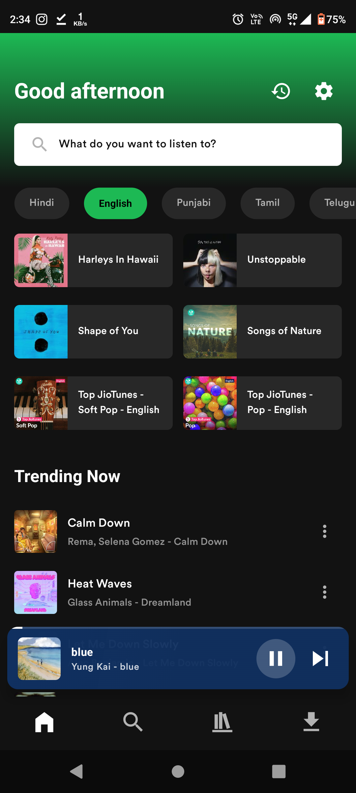
      <br/>
      <b>Home Feed</b>
      <br/>
      <sub>Trending content and suggestions</sub>
    </td>
    <td align="center" width="33%">
      
      <br/>
      <b>Full Player</b>
      <br/>
      <sub>Immersive playback experience</sub>
    </td>
    <td align="center" width="33%">
      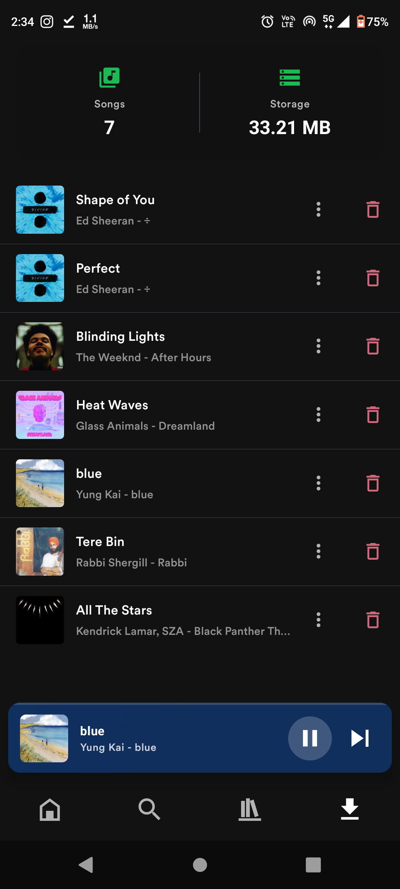
      <br/>
      <b>Downloads</b>
      <br/>
      <sub>Offline content management</sub>
    </td>
  </tr>
</table>

### Search & Discovery

<table>
  <tr>
    <td align="center" width="33%">
      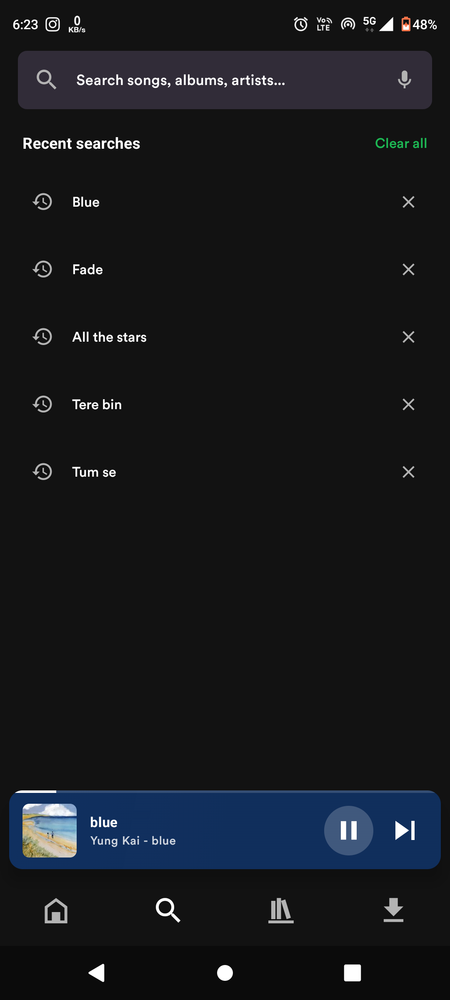
      <br/>
      <b>Search Interface</b>
      <br/>
      <sub>Full text search over categories</sub>
    </td>
    <td align="center" width="33%">
      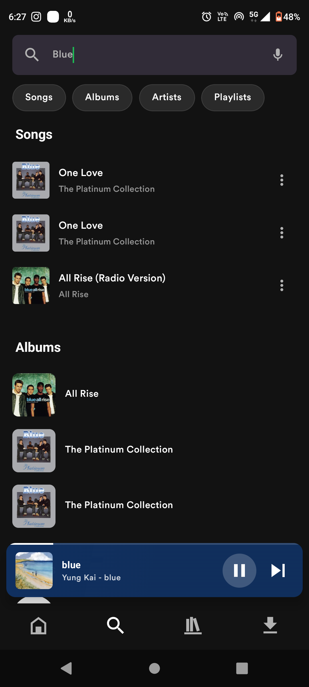
      <br/>
      <b>Search Results</b>
      <br/>
      <sub>Categorized results with quick filters</sub>
    </td>
    <td align="center" width="33%">
      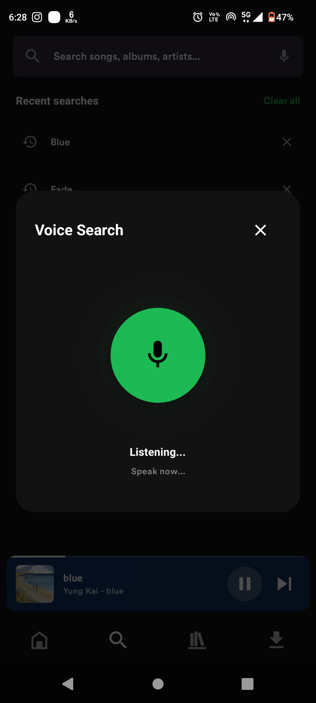
      <br/>
      <b>Voice Search</b>
      <br/>
      <sub>On-Device Voice Search</sub>
    </td>
  </tr>
</table>

### Media Details

<table>
  <tr>
    <td align="center" width="33%">
      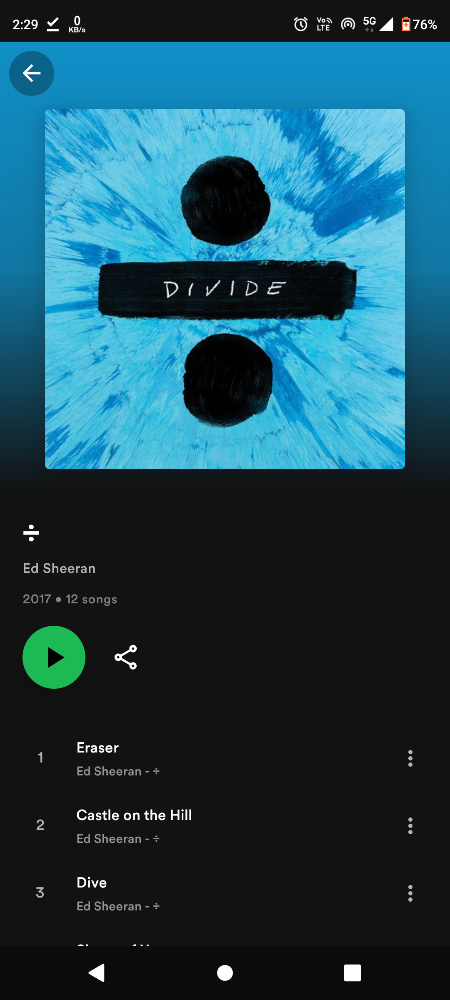
      <br/>
      <b>Album View</b>
      <br/>
      <sub>Complete album information</sub>
    </td>
    <td align="center" width="33%">
      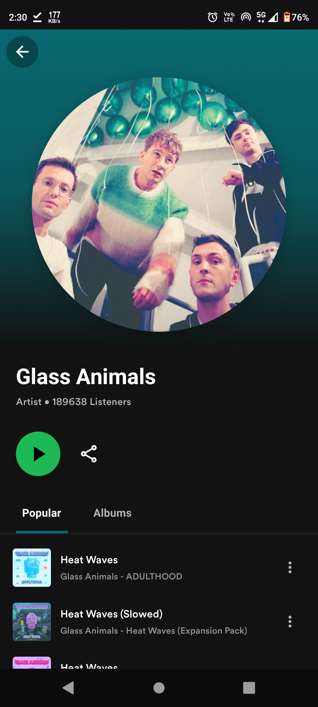
      <br/>
      <b>Artist Profile</b>
      <br/>
      <sub>Top tracks & discography</sub>
    </td>
    <td align="center" width="33%">
      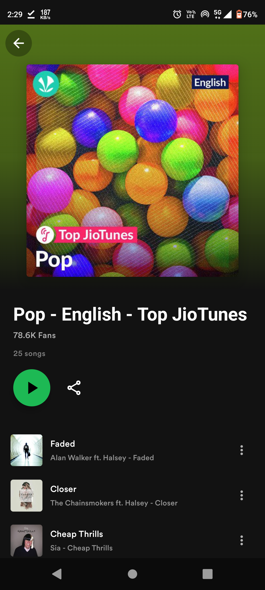
      <br/>
      <b>Playlist View</b>
      <br/>
      <sub>Curated & custom playlists</sub>
    </td>
  </tr>
</table>

### Library & Collections

<table>
  <tr>
    <td align="center" width="33%">
      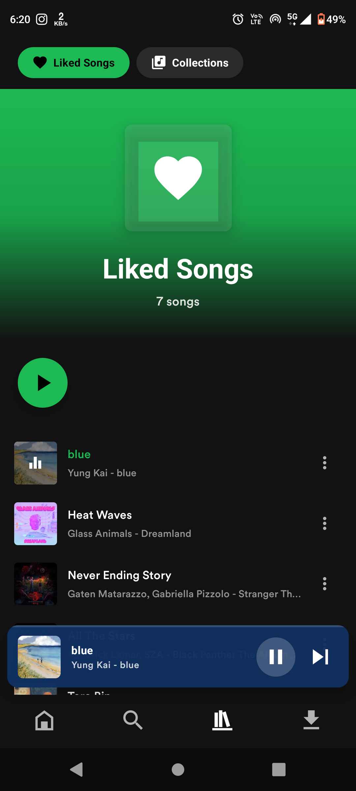
      <br/>
      <b>Favorites</b>
      <br/>
      <sub>Liked songs & albums</sub>
    </td>
    <td align="center" width="33%">
      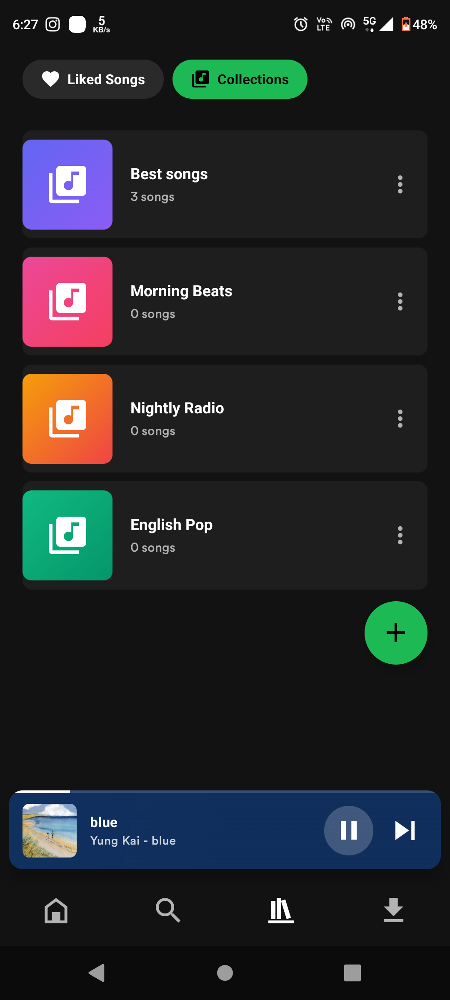
      <br/>
      <b>Collections</b>
      <br/>
      <sub>Organized library sections</sub>
    </td>
    <td align="center" width="33%">
      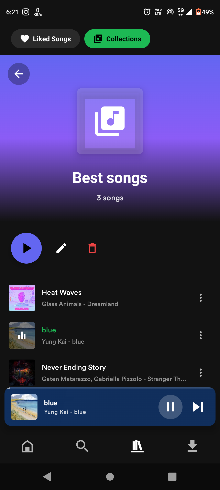
      <br/>
      <b>Custom Collection</b>
      <br/>
      <sub>User-defined music collections</sub>
    </td>
  </tr>
</table>

### Bonus Features

<table>
  <tr>
    <td align="center" width="33%">
      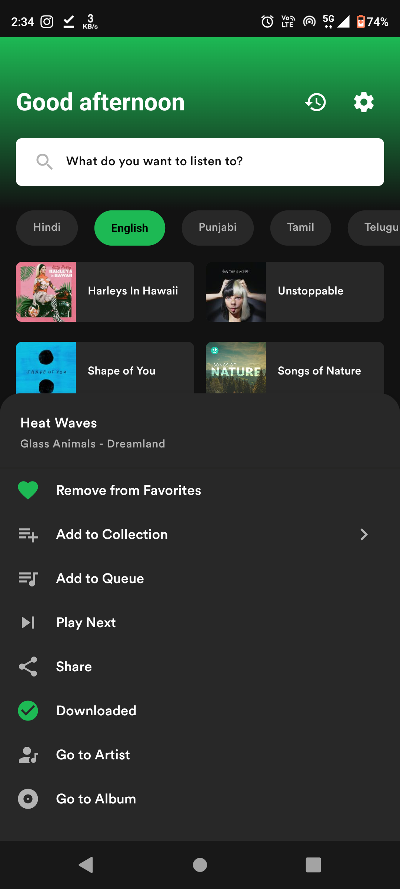
      <br/>
      <b>Track Menu</b>
      <br/>
      <sub>Context menu with rich actions</sub>
    </td>
    <td align="center" width="33%">
      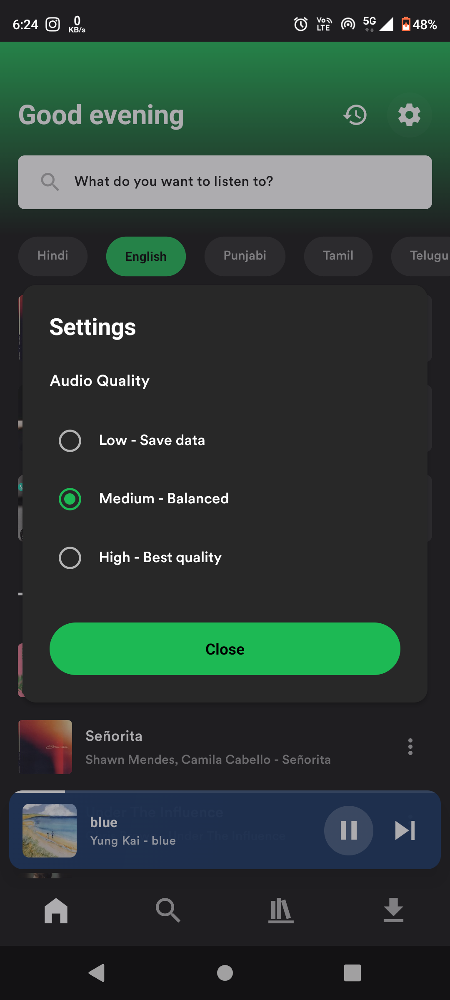
      <br/>
      <b>Audio Quality</b>
      <br/>
      <sub>High fidelity playback options</sub>
    </td>
    <td align="center" width="33%">
      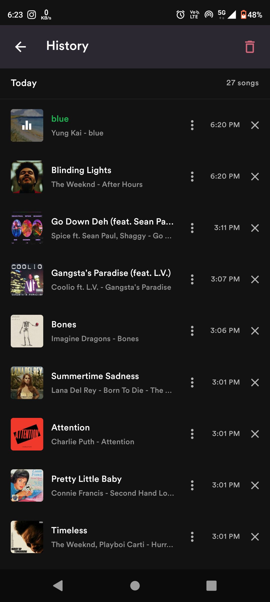
      <br/>
      <b>History</b>
      <br/>
      <sub>List of recently played tracks</sub>
    </td>
  </tr>
</table>

---

## 🚀 Quick Start

### Prerequisites

Before you begin, ensure you have the following installed:

| Requirement                 | Version          | Download                                                          |
| --------------------------- | ---------------- | ----------------------------------------------------------------- |
| **Node.js**                 | 18.x or higher   | [nodejs.org](https://nodejs.org/)                                 |
| **Java JDK**                | 17 (recommended) | [Oracle JDK](https://www.oracle.com/java/technologies/downloads/) |
| **Android SDK**             | Latest           | Via Android Studio                                                |
| **Android Device/Emulator** | API 21+          | [Android Studio](https://developer.android.com/studio)            |

> **⚠️ Important Notice**
>
> This project uses native modules and cannot run in **Expo Go**. You must build and run a **development client**.

### Installation

1. **Clone the repository**

```bash
git clone https://github.com/saavn-labs/saavn-music.git
cd saavn-music
```

2. **Install dependencies**

```bash
# Using npm
npm install

# Using yarn
yarn install

# Using bun
bun install
```

3. **Build and run development client**

```bash
# Build and install on connected Android device/emulator
npm run android

# Start the Metro bundler
npx expo start --dev-client
```

4. **Launch the app**

Open the installed development client on your device and it will automatically connect to Metro.

---

## 🐛 Troubleshooting

### Common Issues

<details>
<summary><b>App crashes on launch</b></summary>

**Solution:**

```bash
# Rebuild the development client
npm run android

# Clear Metro cache
npx expo start -c
```

</details>

<details>
<summary><b>No audio playback</b></summary>

**Possible causes:**

- Development client not properly installed
- Android audio focus not granted
- Service not registered in `AndroidManifest.xml`

**Solution:**

```bash
# Reinstall with clean build
cd android && ./gradlew clean
cd .. && npm run android
```

</details>

<details>
<summary><b>Build errors with Gradle</b></summary>

**Solution:**

```bash
# Clean Gradle cache
cd android
./gradlew clean
rm -rf .gradle
cd ..

# Rebuild
npm run android
```

</details>

<details>
<summary><b>Metro bundler issues</b></summary>

**Solution:**

```bash
# Clear all caches
npx expo start -c
watchman watch-del-all  # If using watchman
rm -rf node_modules && npm install
```

</details>

---

## 📄 Legal Notice

**This is an unofficial application.**

- Not affiliated with, endorsed by, or connected to JioSaavn
- Does not host, store, or redistribute any copyrighted content
- All media data and URLs are fetched from publicly accessible APIs
- Usage compliance is the sole responsibility of the end user

This project is intended for **educational and personal use only**. Please respect copyright laws and support artists by using official platforms.

---

## License

**MIT** © 2025 Saavn Labs

See [LICENSE](./LICENSE) for details.

---

Built by **Saavn Labs** with a focus on correctness and longevity.
